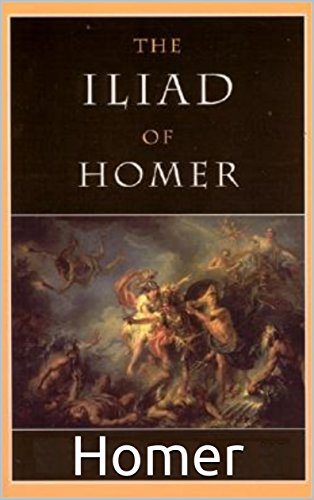
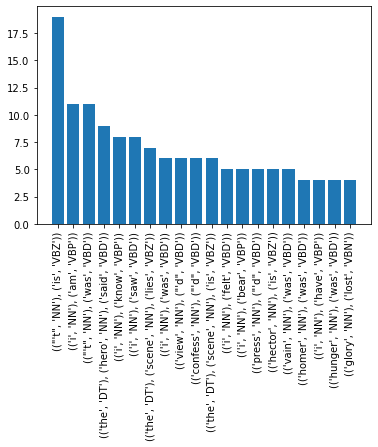
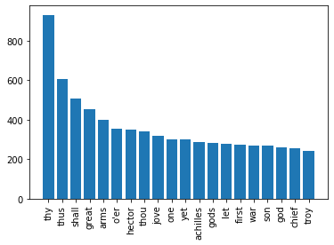

# Getting Insights About The Tone of Classic books: A Case Study For Homer's The Illiad
This project is nothing but applying most common NLP techniques in order to gain some insights about the tone of The Iliad by Homer.

  

